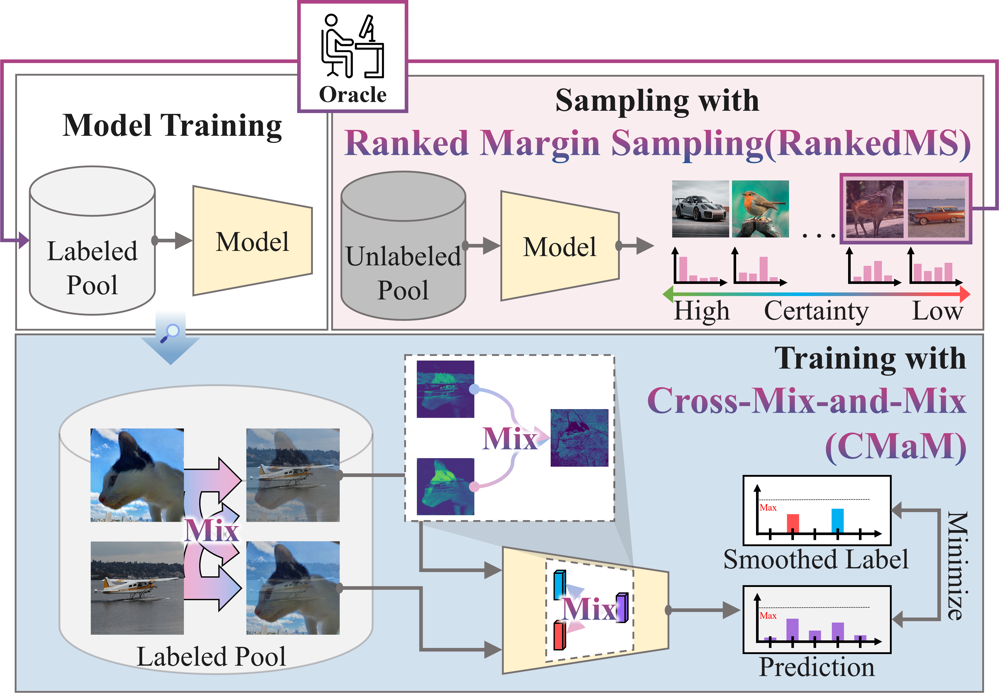
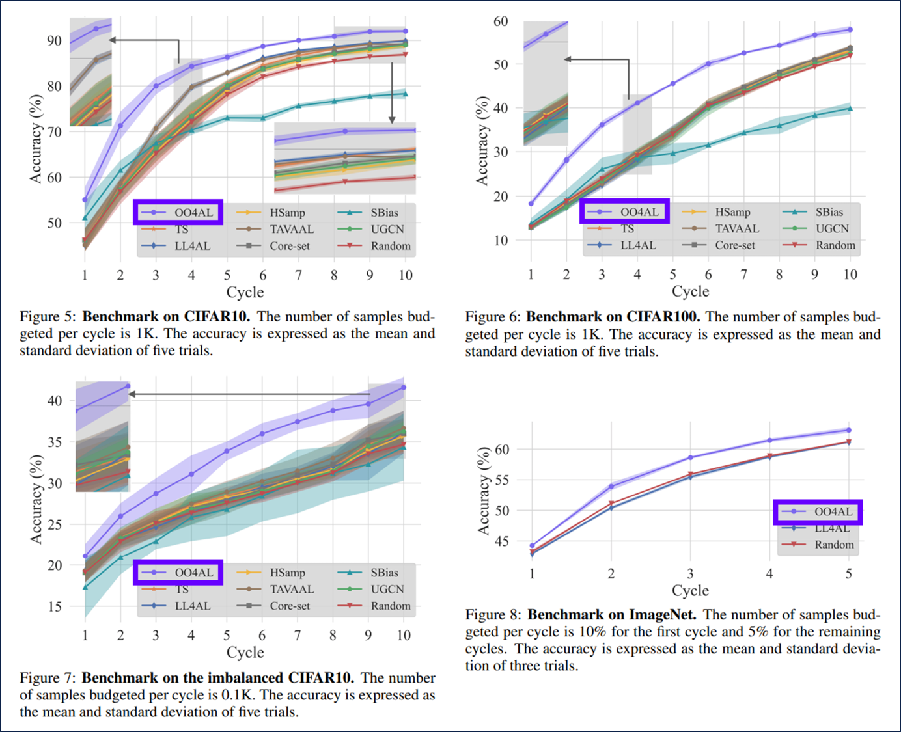

# OO4AL: Overcoming Overconfidence for Active Learning

### Official Pytorch Implementation of OO4AL: Overcoming Overconfidence for Active Learning

<p align="center"></p>

> **Paper**: [Overcoming Overconfidence for Active Learning]

---

# ⏩ For a fast evaluation on OO4AL

* For a fast verification, a simple evaluation protocol is guided as follows.

<p align="center"></p>

- The process of fast evaluation for **benchmark datasets[OO4AL on CIFAR10, CIFAR100, CIFAR10-LT(imbalanced CIFAR10), ImageNet]** can be summarized into 3 steps:

  1. Download the checkpoint from an anonymous [Google Drive link](https://drive.google.com/drive/folders/1Fs4T_owEnaJexodPNc_ALe-57k4VDrB6?usp=sharing).

  2. Please locate the checkpoint as below
     * Place the checkpoints inside the ```jobs``` folder
~~~~
├── jobs
   └── cifar10
      └── Init1000_S10000_B1000
         ├── Seed-0
         ├── Seed-1
         └── ...      
   └── cifar100
      └── Init1000_S10000_B1000
         ├── Seed-0
         ├── Seed-1
         └── ...   
   └── cifar10lt
      └── Init100_S1000_B100
         ├── Seed-0
         ├── Seed-1
         └── ...   
   └── imagenet
      └── Init128120_S640600_B64060
         ├── Seed-0
         ├── Seed-1
         └── ...   
~~~~

  3. Run the command to evaluate the **OO4AL on benchmark datasets**
     * ```fast_evaluation_cifar10.sh```
     * ```fast_evaluation_cifar100.sh```
     * ```fast_evaluation_imbalance_cifar10.sh```
     * ```fast_evaluation_imagenet.sh```  # please download the imagenet datasets first.

# 🎞 Data Preparation
## Getting the Dataset
* CIFAR10 and CIFAR100 are automatically downloaded when code is executed.
* ImageNet can be downloaded from https://www.image-net.org/
* The ImageNet data should be located like the structure below. 

~~~~
├── ImageNet
   └── train_task12
      ├── n01440764
      ├── n01443537
      └── ...
   └── validation
      ├── n01440764
      ├── n01443537
      └── ...
~~~~
    
# 🔨 Prerequisites

### Recommended Environment
* OS - Ubuntu 18.04
* CUDA - 11.7
* Python - 3.7.16
* Pytorch - 1.13.1
* GPU Hardward  - A6000
* Our packages are listed in **requirement.txt**. You can install by running:

```
pip install -r requirement.txt
```


# 🚀 Running

To run the training code for each dataset, use the following scripts:

```bash
# Run CIFAR-10 training
bash run_train_cifar10.sh
# Run CIFAR-100 training
bash run_train_cifar100.sh
# Run imbalanced CIFAR-10 training
bash run_train_imbalance_cifar10.sh
# Run ImageNet training
bash run_train_imagenet.sh
```

Each script file performs training for the respective dataset. Additionally, you can modify the APP option in the run_train_{dataset name}.sh file to choose a different methodology. Here is a list of available methodologies:

|Notation in Figure|Paper|{APP}|
|------|---|---|
|Random|-|Random|
|OO4AL|Overcoming Overconfidence for Active Learning(Propsed)|OO4AL|
|UGCN|Sequential graph convolutional network for active learning|UncertainGCN|
|Core-set|Active learning for convolutional neural networks: A core-set approach|CoreSet|
|LL4AL|Learning Loss for Active Learning|LL4AL|
|TAVAAL|Task-Aware Variational Adversarial Active Learning|TA-VAAL|
|HSamp|Hierarchical sampling for active learning|Hierarchical|
|TS|On calibration of modern neural networks|TS|

...
For training "On statistical bias in active learning: How and when to fix it" (SBias), download the [data file](https://drive.google.com/file/d/1lcimO1j1bUFChyxAjF3X47MK0CA0lLIw/view?usp=sharing) and unzip it into the ```Sbias/data``` folder.
After that, use the following commands:

```bash
cd ./Sbias
python main_cifar10.py 
python main_cifar10_100.py 
python main_cifar10_500.py
python main_cifar10im.py 
python main_cifar100.py 
```


# Special Thanks to Inspirational Projects 🌟

### Learning Loss for Active Learning
[GitHub Link](https://github.com/Mephisto405/Learning-Loss-for-Active-Learning)

Thank you to the contributors of "Learning Loss for Active Learning" for their fantastic work in exploring learning loss strategies for active learning. Your research and code have been valuable in advancing the field. Kudos! 🚀

### Statistical Bias in Active Learning
[GitHub Link](https://github.com/SebFar/statistical_bias_in_active_learning/tree/main)

A big thank you to the team behind "Statistical Bias in Active Learning" for their insightful research and code contributions. Your efforts in addressing statistical bias in active learning are truly commendable. Much appreciated! 🚀

### TA-VAAL (Task-Aware Variational Adversarial Active Learning)
[GitHub Link](https://github.com/cubeyoung/TA-VAAL)

Heartfelt thanks to the creators of "TA-VAAL" for their innovative work in Task-Aware Variational Adversarial Active Learning. Your repository has been a valuable resource for understanding and implementing advanced active learning techniques. Great job! 🚀

---
This project has been inspired and influenced by the remarkable work of these projects. Special thanks to the developers and contributors for their dedication to advancing the field of active learning. 🙌
